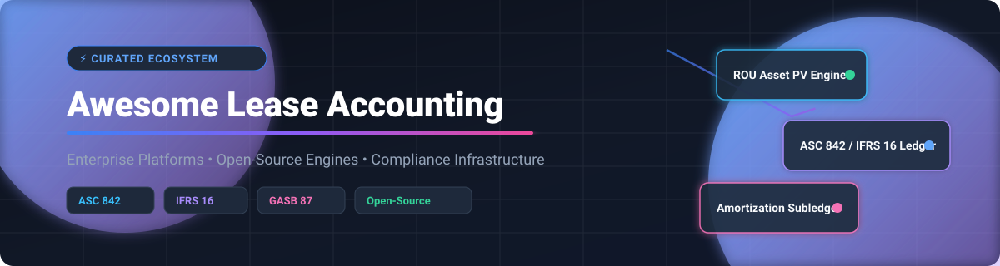

# 🏢 Awesome-Lease-Accounting-Software

<p align="center">
  
</p>

# 🏢 Awesome Lease Accounting Software & Open-Source Financial Engines

<p align="center">
  <a href="https://github.com/ishandutta2007/Awesome-Awesome-Awesome"></a>
  <a href="https://discord.gg/jc4xtF58Ve"></a>
  <a href="https://github.com/ishandutta2007/Awesome-Awesome-Awesome"></a>
  <a href="LICENSE"></a>
  <a href="https://fasb.org"></a>
  <a href="https://ifrs.org"></a>
  <a href="https://gasb.org"></a>
  <a href="https://github.com/ishandutta2007"></a>
</p>

> 📚 A curated directory of **lease accounting software, lease administration platforms, real-estate management systems, and open-source financial ledgers** for automating **ASC 842, IFRS 16, GASB 87, and GASB 96** compliance workflows.

Lease accounting software bridges **lease administration** and the **general ledger**, maintaining lease contract terms, payment schedules, Right-of-Use (ROU) assets, lease liabilities, amortization schedules, journal entries, disclosure reports, lease modifications, and audit trails.

This repository serves enterprise architects, financial controllers, CPAs, and software engineers by providing a comprehensive comparison of **commercial SaaS solutions** and **open-source building blocks** (financial calculation libraries, double-entry ledger engines, ERP modules, and AI lease extraction tools).

---

## 📑 Table of Contents

* [☁️ SaaS / Hosted Enterprise Platforms](#️-saas--hosted-enterprise-platforms)
* [🌍 Open-Source Lease Accounting Ecosystem](#-open-source-lease-accounting-ecosystem)
* [🧮 Open-Source Lease Accounting Engines](#-open-source-lease-accounting-engines)
* [🏢 Open-Source Lease & Property Management](#-open-source-lease--property-management)
* [💰 Open-Source Accounting & ERP Platforms](#-open-source-accounting--erp-platforms)
* [📚 Open-Source Financial Ledger Engines](#-open-source-financial-ledger-engines)
* [📄 Open-Source Lease Abstraction & Document AI](#-open-source-lease-abstraction--document-ai)
* [🔢 Financial Calculation & Math Libraries](#-financial-calculation--math-libraries)
* [🏗️ Lease Accounting Architecture & Workflows](#️-lease-accounting-architecture--workflows)
* [⚖️ Commercial vs Open-Source Comparison](#️-commercial-vs-open-source-comparison)
* [🚀 Recommended Open-Source Stacks](#-recommended-open-source-stacks)
* [💖 Support & Community](#-support--community)
* [📈 Star History](#-star-history)
* [🤝 Contributing](#-contributing)
* [⚠️ Disclaimer](#️-disclaimer)

---

# ☁️ SaaS / Hosted Enterprise Platforms

> 🌐 **Market Overview:** The global lease accounting and management software market is estimated at **$2.8 Billion in 2025** (projected to reach **$5.1 Billion by 2030** at a CAGR of ~12.8%) and remains **moderately fragmented**, balancing enterprise IWMS/ERP giants (IBM, CoStar, MRI Software) alongside specialized, agility-focused compliance platforms (FinQuery/LeaseQuery, Trullion, Netgain).

Commercial lease accounting platforms combine real estate lease administration, automated accounting schedule calculations (ROU Asset & Lease Liability), audit trail tracking, disclosure reporting, and ERP integrations (SAP, Oracle, NetSuite, Workday).

| 🏢 Platform | 🏬 Parent Company | 📊 Company Size (Revenue / Valuation) | 💵 Starting Pricing | 🎁 Free Tier / Trial Limit | ⚡ Primary Focus & Capabilities |
| :--- | :--- | :--- | :--- | :--- | :--- |
| [IBM TRIRIGA](https://www.ibm.com/products/tririga) | IBM | **$62 Billion Rev** / $210B Market Cap | **$2,500/year** ($208/user/mo) | **30-day interactive demo sandbox** trial upon enterprise request | IWMS, facility management, ASC 842 & IFRS 16 lease accounting schedules, capital project tracking |
| [CoStar Real Estate Manager](https://www.costar.com/) | CoStar Group | **$2.5 Billion Rev** / $30B Market Cap | **$12,000/year** | **14-day guided enterprise trial** & portfolio assessment workspace | Corporate real estate portfolio administration, complex lease modification accounting, rent roll analytics |
| [Visual Lease](https://visuallease.com/) | CoStar Group | **$2.5 Billion Parent Rev** / $30B Market Cap | **$3,500/year** base tier | **14-day interactive sandbox trial** (up to 10 sample lease contracts) | Lease administration + accounting hybrid, CAM reconciliations, journal entry exports |
| [Planon Lease Accounting](https://planonsoftware.com/) | Planon (Schneider Electric) | **$250 Million Rev** / $140B Parent Cap | **$10,000/year** | **30-day interactive IWMS demo trial** | Real estate, IWMS integration, IFRS 16 & ASC 842 compliance, multi-currency asset subledgers |
| [Accruent Lucernex](https://www.accruent.com/) | Accruent (Fortive) | **$200 Million Rev** / $26B Parent Cap | **$5,000/year** | **14-day guided proof-of-concept trial** | Commercial real estate management, site selection, lease administration, audit-ready compliance |
| [MRI Lease Management](https://www.mrisoftware.com/) | MRI Software | **$500 Million Rev** / $3.5B Valuation | **$3,000/year** | **14-day trial environment** with sample lease data pre-loaded | Real estate property management, tenant billing, ASC 842 disclosure generation |
| [MRI ProLease](https://www.mrisoftware.com/) | MRI Software | **$500 Million Rev** / $3.5B Valuation | **$3,000/year** | **14-day full feature trial workspace** upon direct request | Lease abstraction, equipment & real estate lease accounting, payment approval controls |
| [AMTdirect](https://www.amtdirect.com/) | MRI Software | **$500 Million Parent Rev** / $3.5B Valuation | **$3,500/year** | **14-day demo workspace trial** for asset and lease administration | Lease administration, real estate document management, ASC 842 balance sheet schedules |
| [FinQuery / LeaseQuery](https://finquery.com/lease-accounting-software/) | FinQuery | **$60 Million Rev** / $300M Valuation | **$1,500/year** starting plan | **14-day trial account** with automated ASC 842/IFRS 16 schedule calculations | Dedicated lease subledger, automated journal entry creation, footnote disclosures, ERP sync |
| [Tango Lease Accounting](https://www.tangolease.com/) | Tango (Berkshire Partners) | **$50 Million Rev** / $250M Valuation | **$8,000/year** | **14-day sandbox access** on request for commercial property portfolios | Retail & office space administration, lease accounting, store lifecycle management |
| [LeaseAccelerator](https://www.leaseaccelerator.com/) | LeaseAccelerator / Trullion | **$40 Million Rev** / $120M Valuation | **$6,000/year** | **14-day enterprise evaluation trial** | Heavy equipment & real estate lease asset management, global asset-level accounting |
| [Trullion](https://trullion.com/) | Trullion | **$25 Million Rev** / $150M Valuation | **$5,000/year** | **14-day free trial with AI document extraction** (up to 5 lease PDFs) | AI-powered lease contract abstraction, PDF disclosure tracking, automated journal entries |
| [DebtBook](https://www.debtbook.com/) | DebtBook | **$15 Million Rev** / $80M Valuation | **$5,000/year** | **14-day trial environment** tailored for GASB 87 / GASB 96 government portfolios | GASB 87 lease accounting, GASB 96 subscription (SBITA) tracking, municipal debt management |
| [NetLease](https://www.netgain.tech/) | Netgain | **$15 Million Rev** / $60M Valuation | **$2,400/year** ($200/month) | **14-day NetSuite/ERP integrated sandbox trial** | NetSuite-native lease subledger, automated ROU asset depreciation, schedule generation |
| [Occupier](https://www.occupier.com/) | Occupier | **$10 Million Rev** / $45M Valuation | **$3,600/year** ($300/month) | **14-day free trial workspace** for commercial tenant lease management | Tenant-focused lease administration, lease accounting schedules, site selection workflows |
| [EZLease](https://www.soft4.com/) | insightsoftware | **$10 Million Rev** / $40M Valuation | **$4,000/year** | **14-day full functionality trial** (up to 10 active lease contracts) | Fast-setup ASC 842 & IFRS 16 compliance for mid-market finance teams, roll-forward reports |
| [SOFT4Lessee](https://www.soft4.com/) | SOFT4 | **$8 Million Rev** / $30M Valuation | **€1,200/year** (€100/month) | **30-day free trial** on Microsoft Dynamics 365 Business Central | Microsoft Dynamics Business Central integration, IFRS 16 / ASC 842 liability calculators |
| [Lease Harbor](https://leaseharbor.com/) | Lease Harbor | **$8 Million Rev** / $30M Valuation | **$2,500/year** | **14-day evaluation environment** upon request | Enterprise lease administration, sub-portfolio tracking, financial disclosures |

---

# 🌍 Open-Source Lease Accounting Ecosystem

The open-source ecosystem provides powerful modular building blocks that can be combined to construct self-hosted, custom lease accounting subledgers:

```text
                                OPEN-SOURCE LEASE ACCOUNTING
                                             │
           ┌─────────────────────────────────┼─────────────────────────────────┐
           │                                 │                                 │
           ▼                                 ▼                                 ▼
   Document Abstraction              Calculation Engines               Accounting / Ledgers
 (Docling, PaddleOCR, Marker)        (NumPy-Financial, NumPy)         (ERPNext, Odoo, Formance)
           │                                 │                                 │
           └─────────────────────────────────┼─────────────────────────────────┘
                                             │
                                             ▼
                                     Financial Subledger
                                 (ROU Assets & Liabilities)
                                             │
                                             ▼
                                  General Ledger / Journal
                                             │
                                             ▼
                                     Disclosure Reports
```

---

# 🧮 Open-Source Lease Accounting Engines

Dedicated open-source repositories designed for ASC 842 and IFRS 16 present value calculations, amortization schedules, and disclosure generation:

| 📦 Repository | 🏷️ GitHub_Stars_Badge | 🎯 Primary Focus / Standards |
| :--- | :--- | :--- |
| [OpenAccountants](https://github.com/openaccountants/openaccountants) | [](https://github.com/openaccountants/openaccountants/stargazers) | Open-source tax & accounting knowledge rules, ASC 842 / IFRS 16 compliance workflows |
| [ERPClaw Lease Module](https://github.com/avansaber/erpclaw) | [](https://github.com/avansaber/erpclaw/stargazers) | AI-native ERP engine with ASC 842 lease calculation & subledger capabilities |
| [VP Real Estate](https://github.com/reggiechan74/vp-real-estate) | [](https://github.com/reggiechan74/vp-real-estate/stargazers) | Real-estate portfolio analysis and IFRS 16 lease liability calculations |
| [Kontor](https://github.com/replikativ/kontor) | [](https://github.com/replikativ/kontor/stargazers) | Trans-national accounting kernel with IFRS 16 & ASC 842 module support |
| [Easy-Books](https://github.com/bilalpiaic/Easy-Books) | [](https://github.com/bilalpiaic/Easy-Books/stargazers) | IFRS 16 lease subledger schedules, ROU asset depreciation, and payment tracking |
| [LeaseBook](https://github.com/jwh3times/LeaseBook) | [](https://github.com/jwh3times/LeaseBook/stargazers) | Property management lease agreements, rent schedules, and trust accounting |
| [Ledger Nexus](https://github.com/ledger-nexus/ledger-core) | [](https://github.com/ledger-nexus/ledger-core/stargazers) | Multi-book general ledger with an integrated ASC 842 lease subledger module |

---

# 🏢 Open-Source Lease & Property Management

Operational platforms for managing tenant leases, property portfolios, and lease contracts:

| 📦 Repository | 🏷️ GitHub_Stars_Badge | 📝 Description |
| :--- | :--- | :--- |
| [Odoo Community](https://github.com/odoo/odoo) | [](https://github.com/odoo/odoo/stargazers) | Open-source enterprise apps including real estate asset & lease management modules |
| [ERPNext](https://github.com/frappe/erpnext) | [](https://github.com/frappe/erpnext/stargazers) | Full ERP system with property management, asset depreciation, and general ledger |
| [Frappe Framework](https://github.com/frappe/frappe) | [](https://github.com/frappe/frappe/stargazers) | Low-code web framework underlying ERPNext for building custom lease portals |
| [Invoice Ninja](https://github.com/invoiceninja/invoiceninja) | [](https://github.com/invoiceninja/invoiceninja/stargazers) | Recurring billing, rent collection, and customer invoice management |
| [Kill Bill](https://github.com/killbill/killbill) | [](https://github.com/killbill/killbill/stargazers) | Open-source subscription billing & payment platform for recurring lease invoices |
| [Frappe Lending](https://github.com/frappe/lending) | [](https://github.com/frappe/lending/stargazers) | Loan and financial contract lifecycle management for complex lease schedules |
| [LeaseBook](https://github.com/jwh3times/LeaseBook) | [](https://github.com/jwh3times/LeaseBook/stargazers) | Open-source property management platform for residential and commercial leases |

---

# 💰 Open-Source Accounting & ERP Platforms

Full-featured financial systems capable of consuming lease accounting journal entries and managing fixed asset subledgers:

| 📦 Repository | 🏷️ GitHub_Stars_Badge | 📊 Accounting Capabilities | 🔗 ASC 842 / IFRS 16 Integration |
| :--- | :--- | :--- | :--- |
| [Odoo Community](https://github.com/odoo/odoo) | [](https://github.com/odoo/odoo/stargazers) | Full double-entry accounting, assets, AP/AR | Custom lease app module |
| [ERPNext](https://github.com/frappe/erpnext) | [](https://github.com/frappe/erpnext/stargazers) | Fixed assets, depreciation schedules, general ledger | Asset lease module integration |
| [Firefly III](https://github.com/firefly-iii/firefly-iii) | [](https://github.com/firefly-iii/firefly-iii/stargazers) | Double-entry transaction engine & budget tracking | Financial transaction auditing |
| [Apache Fineract](https://github.com/apache/fineract) | [](https://github.com/apache/fineract/stargazers) | Portfolio ledger, loan & lease schedule calculation | Custom financial integration |
| [ERPClaw](https://github.com/avansaber/erpclaw) | [](https://github.com/avansaber/erpclaw/stargazers) | Double-entry GL, multi-company subledger | Built-in ASC 842 lease schedules |
| [Easy-Books](https://github.com/bilalpiaic/Easy-Books) | [](https://github.com/bilalpiaic/Easy-Books/stargazers) | Multi-tenant bookkeeping for small businesses | IFRS 16 lease schedule support |

---

# 📚 Open-Source Financial Ledger Engines

High-throughput, immutable ledgers ideal for storing lease liability balance histories and double-entry postings:

| 📦 Repository | 🏷️ GitHub_Stars_Badge | 🛠️ Primary Role | ✨ Key Features |
| :--- | :--- | :--- | :--- |
| [Apache Fineract](https://github.com/apache/fineract) | [](https://github.com/apache/fineract/stargazers) | Core banking & financial services engine | Amortization calculations, interest accruals, audit trails |
| [Formance Ledger](https://github.com/formancehq/ledger) | [](https://github.com/formancehq/ledger/stargazers) | Programmable financial core ledger | Numscript language for complex multi-party lease journal postings |
| [Ledger Nexus](https://github.com/ledger-nexus/ledger-core) | [](https://github.com/ledger-nexus/ledger-core/stargazers) | Multi-book accounting subledger | Native ASC 842 present value and liability reduction rules |

---

# 📄 Open-Source Lease Abstraction & Document AI

Tools for parsing unstructured lease agreement PDFs/DOCX files into structured JSON for calculation engines:

| 📦 Repository | 🏷️ GitHub_Stars_Badge | 📂 Category | 💡 Specialty |
| :--- | :--- | :--- | :--- |
| [Ollama](https://github.com/ollama/ollama) | [](https://github.com/ollama/ollama/stargazers) | Local LLM Runner | Local LLM execution (Llama 3, Qwen) for private lease extraction |
| [LangChain](https://github.com/langchain-ai/langchain) | [](https://github.com/langchain-ai/langchain/stargazers) | LLM Orchestration | RAG pipelines over long lease contract documents |
| [vLLM](https://github.com/vllm-project/vllm) | [](https://github.com/vllm-project/vllm/stargazers) | High-throughput LLM | Batch processing thousands of lease PDF contracts |
| [PaddleOCR](https://github.com/PaddlePaddle/PaddleOCR) | [](https://github.com/PaddlePaddle/PaddleOCR/stargazers) | OCR & Document AI | Multilingual table & text extraction from scanned lease agreements |
| [MinerU](https://github.com/opendatalab/MinerU) | [](https://github.com/opendatalab/MinerU/stargazers) | PDF Document Extraction | Extracting complex lease table structures to Markdown |
| [Tesseract OCR](https://github.com/tesseract-ocr/tesseract) | [](https://github.com/tesseract-ocr/tesseract/stargazers) | Optical Character Recognition | Standard OCR engine for text recognition |
| [Docling](https://github.com/docling-project/docling) | [](https://github.com/docling-project/docling/stargazers) | Document Parsing | Structural parsing of lease contracts into clean JSON schemas |
| [Marker](https://github.com/datalab-to/marker) | [](https://github.com/datalab-to/marker/stargazers) | PDF Parsing | Converts PDF lease agreements to clean Markdown |
| [DSPy](https://github.com/stanfordnlp/dspy) | [](https://github.com/stanfordnlp/dspy/stargazers) | Programmatic Prompting | Optimizing lease field extraction prompts automatically |
| [OCRmyPDF](https://github.com/ocrmypdf/OCRmyPDF) | [](https://github.com/ocrmypdf/OCRmyPDF/stargazers) | PDF Tooling | Adds searchable OCR layers to scanned lease PDF files |
| [Surya](https://github.com/datalab-to/surya) | [](https://github.com/datalab-to/surya/stargazers) | OCR & Layout Analysis | Layout detection and text line extraction |
| [Outlines](https://github.com/dottxt-ai/outlines) | [](https://github.com/dottxt-ai/outlines/stargazers) | Structured Generation | Guarantees strict JSON output formatting from LLMs |
| [Unstructured](https://github.com/Unstructured-IO/unstructured) | [](https://github.com/Unstructured-IO/unstructured/stargazers) | Data Ingestion | Ingesting PDF, DOCX, and scanned images for AI pipelines |
| [Instructor](https://github.com/567-labs/instructor) | [](https://github.com/567-labs/instructor/stargazers) | Pydantic LLM Output | Extracting validated Pydantic structures from lease texts |
| [LayoutParser](https://github.com/Layout-Parser/layout-parser) | [](https://github.com/Layout-Parser/layout-parser/stargazers) | Document Layout Detection | Deep-learning visual layout parsing for PDF documents |

---

# 🔢 Financial Calculation & Math Libraries

Mathematical and financial calculation libraries used to compute present value (PV), net present value (NPV), internal rate of return (IRR), and amortization:

| 📦 Repository | 🏷️ GitHub_Stars_Badge | 💻 Language / Focus | 🎯 Use Case in Lease Accounting |
| :--- | :--- | :--- | :--- |
| [NumPy Financial](https://github.com/numpy/numpy-financial) | [](https://github.com/numpy/numpy-financial/stargazers) | Python | Standard financial functions (`npf.pv`, `npf.pmt`, `npf.irr`, `npf.nper`) |
| [QuantLib](https://github.com/quantlib/QuantLib) | [](https://github.com/quantlib/QuantLib/stargazers) | C++ / Python | Complex interest rate curve discounting and financial math modeling |

---

# 🏗️ Lease Accounting Architecture & Workflows

## Present Value & Schedule Calculation Engine

```text
Lease Contract Inputs
  ├── Start Date & Expiration Date
  ├── Monthly / Annual Rent Payments
  ├── Payment Timing (In Advance vs In Arrears)
  ├── Escalation Clauses (CPI / Fixed %)
  ├── Initial Direct Costs & Lease Incentives
  └── Incremental Borrowing Rate (IBR)
          │
          ▼
   Lease Classification
  ├── Operating Lease (ASC 842)
  └── Finance / Capital Lease (ASC 842 / IFRS 16)
          │
          ▼
   Present Value (PV) Engine
  ├── Lease Liability = PV of Future Lease Payments
  └── ROU Asset = Initial Lease Liability + Direct Costs - Incentives Received
          │
          ▼
   Amortization Subledger
  ├── Period-by-Period Interest Accrual
  ├── ROU Asset Straight-Line / Amortization Expense
  └── Payment Execution & Balance Reduction
          │
          ▼
   General Ledger Postings
  ├── Dr. Right-of-Use Asset
  ├── Cr. Lease Liability
  └── Dr. Lease Expense / Cr. Cash & Accumulated Depreciation
```

---

# ⚖️ Commercial vs Open-Source Comparison

| 🔍 Feature Dimension | 🏢 Commercial SaaS (e.g., LeaseQuery, Visual Lease) | 🔓 Open-Source Stack (e.g., ERPNext + Formance + Docling) |
| :--- | :--- | :--- |
| **Deployment Speed** | Rapid turnkey cloud deployment | Requires architecture setup & self-hosting |
| **Data Privacy** | SaaS multi-tenant cloud storage | 100% on-premises / private VPC control |
| **Customization** | Configurable standard workflows | Complete source code access & unlimited extension |
| **Audit Readiness** | Pre-built SOC-certified disclosure reporting | Requires custom validation & testing |
| **Cost Model** | Annual subscription per lease / user | Free open-source licenses + infrastructure hosting |

---

# 🚀 Recommended Open-Source Stacks

1. **🐍 Python Compliance Stack:** `Docling` (Document OCR) + `NumPy-Financial` (PV Engine) + `OpenAccountants` (Rule Engine) + `FastAPI`
2. **🏢 Enterprise ERP Stack:** `Frappe / ERPNext` + `Formance Ledger` (Immutable Journal Ledger) + `PostgreSQL`
3. **🤖 AI-First Extraction Stack:** `Ollama` + `Instructor` (Pydantic Schema) + `Unstructured` + `Streamlit`

---

# 💖 Support & Community

If you find this repository helpful for your lease accounting workflows, financial architecture research, or software development, please consider supporting the project:

* 🌟 **Star this repository** to help other finance & tech professionals discover it.
* 🍴 **Fork this repo** to contribute new open-source software tools, calculation engines, or SaaS pricing updates.
* 📢 **Share this resource** with your network, engineering team, or accounting department.
* ☕ **Buy me a coffee**: Support ongoing open-source maintenance via the [GitHub Sponsor Dashboard](https://github.com/sponsors/ishandutta2007).

---

## 📈 Star History

[](https://star-history.dera.page/#ishandutta2007/Awesome-Lease-Accounting-Software&type=date&legend=top-left)

---

# 🤝 Contributing

Contributions are welcome! Please feel free to submit a Pull Request.

1. 🍴 Fork the repository
2. 🌿 Create your feature branch (`git checkout -b feature/awesome-feature`)
3. 💾 Commit your changes (`git commit -m 'Add awesome feature'`)
4. 🚀 Push to the branch (`git push origin feature/awesome-feature`)
5. 📬 Open a Pull Request

---

# ⚠️ Disclaimer

This repository is for educational and informational purposes only. Consult a certified public accountant (CPA) or audit firm for official compliance advice regarding ASC 842, IFRS 16, or GASB 87 standards.
