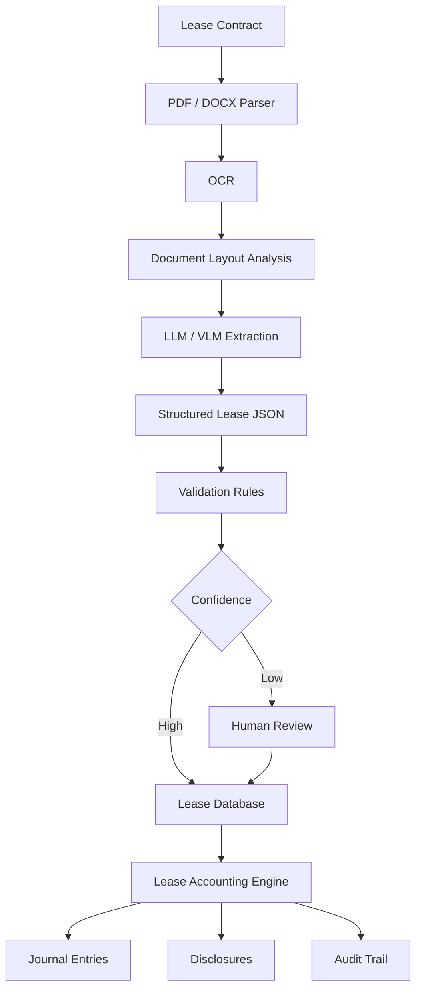
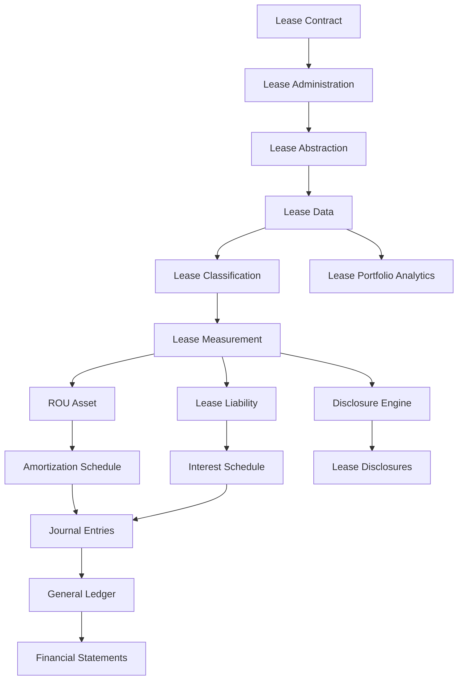
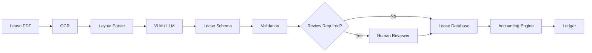
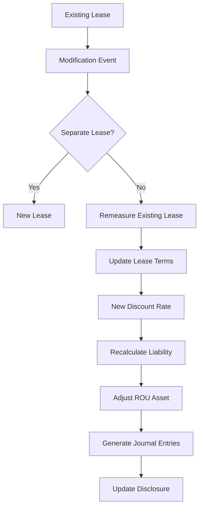

# Awesome-Lease-Accounting-Software

# 🏢 Top Lease Accounting Software & Open-Source Lease Accounting


> A curated list of **lease accounting software, lease administration platforms, real-estate lease management systems and open-source software** for managing lease portfolios and automating **ASC 842, IFRS 16, GASB 87 and related lease accounting workflows**.


Lease accounting software typically sits between **lease administration** and the **general ledger**, maintaining lease contracts, payment schedules, right-of-use (ROU) assets, lease liabilities, amortization schedules, journal entries, disclosures, modifications and audit trails.


This repository focuses primarily on **open-source and self-hostable building blocks** that can be used to construct lease accounting systems, while keeping commercial platforms such as LeaseQuery, Visual Lease, Nakisa, CoStar Real Estate Manager, LeaseAccelerator, Accruent Lucernex, MRI Lease Management, Planon, IBM TRIRIGA and FinQuery separate.


> **Important:** The open-source ecosystem for dedicated enterprise lease accounting is considerably smaller than the commercial market. Consequently, the open-source section includes both dedicated lease-accounting projects and broader **ERP, accounting, real-estate, ledger, lease-management and calculation components** that can be combined to build a self-hosted solution.


---


## 📑 Table of Contents


* [☁️ SaaS/Hosted Platforms](#️-saashosted-platforms)

* [🌍 Open-Source](#-open-source)

* [🧮 Open-Source Lease Accounting Engines](#-open-source-lease-accounting-engines)

* [🏢 Open-Source Lease & Property Management](#-open-source-lease--property-management)

* [💰 Open-Source Accounting & ERP Platforms](#-open-source-accounting--erp-platforms)

* [📚 Open-Source Financial Ledger Engines](#-open-source-financial-ledger-engines)

* [📄 Open-Source Lease Abstraction](#-open-source-lease-abstraction)

* [🤖 Open-Source AI Lease Extraction](#-open-source-ai-lease-extraction)

* [📊 Open-Source Real Estate Management](#-open-source-real-estate-management)

* [🔢 Open-Source Financial Calculation Libraries](#-open-source-financial-calculation-libraries)

* [🧾 Open-Source Reporting & Disclosure Infrastructure](#-open-source-reporting--disclosure-infrastructure)

* [🧩 Commercial Platform → Open-Source Equivalent](#-commercial-platform--open-source-equivalent)

* [🏗️ Lease Accounting Architecture](#️-lease-accounting-architecture)

* [🔄 Open-Source Lease Accounting Architecture](#-open-source-lease-accounting-architecture)

* [📑 Lease-to-Ledger Architecture](#-lease-to-ledger-architecture)

* [🤖 AI Lease Abstraction Architecture](#-ai-lease-abstraction-architecture)

* [⚖️ Commercial vs Open-Source](#️-commercial-vs-open-source)

* [🚀 Recommended Open-Source Stacks](#-recommended-open-source-stacks)

* [📊 Lease Accounting Technology Comparison](#-lease-accounting-technology-comparison)

* [🎯 Recommended Projects by Use Case](#-recommended-projects-by-use-case)

* [🏢 Building a LeaseQuery Alternative](#-building-a-leasequery-alternative)

* [🏗️ Building an Open-Source Lease Accounting Platform](#-building-an-open-source-lease-accounting-platform)

* [🌐 Open-Source Lease Accounting Landscape](#-open-source-lease-accounting-landscape)

* [🧠 Why Open-Source Lease Accounting Matters](#-why-open-source-lease-accounting-matters)

* [🤝 Contributing](#-contributing)

* [⚠️ Disclaimer](#️-disclaimer)


---


# ☁️ SaaS/Hosted Platforms


Commercial lease accounting platforms combine lease administration, accounting calculations, reporting, compliance and integrations.


| Platform                                                      | Company          | Primary Focus                     | Key Capabilities                                                      |

| ------------------------------------------------------------- | ---------------- | --------------------------------- | --------------------------------------------------------------------- |

| [LeaseQuery](https://finquery.com/lease-accounting-software/) | FinQuery         | Lease accounting                  | ASC 842, IFRS 16, GASB, lease subledger, journal entries, disclosures |

| [Visual Lease](https://visuallease.com/)                      | CoStar Group     | Lease administration + accounting | Lease administration, accounting, portfolio management, reporting     |

| [Nakisa Lease Administration](https://www.nakisa.com/)        | Nakisa           | Enterprise lease management       | Lease accounting, administration, global portfolios, ERP integration  |

| [CoStar Real Estate Manager](https://www.costar.com/)         | CoStar           | Real estate + lease management    | Real estate portfolio, lease administration, accounting, analytics    |

| [LeaseAccelerator](https://www.leaseaccelerator.com/)         | LeaseAccelerator | Enterprise lease accounting       | Lease lifecycle, accounting, compliance, reporting                    |

| [Accruent Lucernex](https://www.accruent.com/)                | Accruent         | CRE / lease management            | Lease administration, real estate, accounting, portfolio management   |

| [MRI Lease Management](https://www.mrisoftware.com/)          | MRI Software     | Real estate lease management      | Lease administration, accounting, property management                 |

| [MRI ProLease](https://www.mrisoftware.com/)                  | MRI Software     | Lease administration + accounting | Lease accounting, lease abstraction, administration                   |

| [Planon](https://planonsoftware.com/)                         | Planon           | IWMS / real estate                | Lease management, workplace, facilities, real estate                  |

| [IBM TRIRIGA](https://www.ibm.com/products/tririga)           | IBM              | IWMS / real estate                | Lease management, facilities, space, capital projects, accounting     |

| [FinQuery](https://finquery.com/)                             | FinQuery         | Financial management              | Lease accounting, contract management, prepaids, accruals             |

| [Trullion](https://trullion.com/)                             | Trullion         | AI financial data                 | Lease accounting, document extraction, accounting automation          |

| [EZLease](https://www.soft4.com/)                             | EZLease / SOFT4  | Lease accounting                  | ASC 842, IFRS 16, GASB, lease schedules                               |

| [NetLease](https://www.netgain.tech/)                         | Netgain          | Lease accounting                  | ASC 842, IFRS 16, ERP-connected lease accounting                      |

| [AMTdirect](https://www.amtdirect.com/)                       | AMTdirect        | Lease management                  | Lease administration, accounting, portfolio management                |

| [Occupier](https://www.occupier.com/)                         | Occupier         | Lease management                  | Lease administration, real estate, accounting                         |

| [Lease Harbor](https://leaseharbor.com/)                      | Lease Harbor     | Lease accounting                  | ASC 842, IFRS 16, lease administration                                |

| [Tango](https://www.tangolease.com/)                          | Tango            | Lease accounting                  | Lease administration, accounting and reporting                        |

| [DebtBook](https://www.debtbook.com/)                         | DebtBook         | Financial management              | Lease accounting and debt management                                  |

| [SOFT4Lessee](https://www.soft4.com/)                         | SOFT4            | Lease accounting                  | ASC 842, IFRS 16 and lease portfolio management                       |


LeaseQuery, now part of FinQuery, provides a cloud-based lease subledger covering standards including ASC 842 and IFRS 16, together with lease management, journal entries, disclosures and ERP integrations.


Visual Lease and LeaseQuery represent somewhat different approaches: Visual Lease combines lease administration and accounting, while LeaseQuery is more accounting-focused.


---


# 🌍 Open-Source


The open-source ecosystem is best understood as a collection of components rather than a single mature equivalent to the commercial enterprise platforms above.


```text

                         OPEN-SOURCE LEASE ACCOUNTING

                                    │

          ┌─────────────────────────┼─────────────────────────┐

          │                         │                         │

          ▼                         ▼                         ▼

   Lease Calculation          Accounting / ERP          Lease Management

          │                         │                         │

          ▼                         ▼                         ▼

   IFRS 16 / ASC 842        ERPNext / Frappe          LeaseBook

   Calculation Engines      ledger-core               Fineract

          │                         │                         │

          └─────────────────────────┼─────────────────────────┘

                                    │

                                    ▼

                              Financial Ledger

                                    │

                                    ▼

                           Journal Entries / GL

                                    │

                                    ▼

                              Reporting

```


The most relevant open-source approaches currently include:


* Dedicated lease-accounting calculators

* General-purpose accounting systems with lease modules

* Open-source financial ledgers

* Property-management platforms

* Lease abstraction and document extraction tools

* Real-estate management systems

* Financial calculation libraries

* Accounting/reporting infrastructure


---


# 🧮 Open-Source Lease Accounting Engines


Dedicated open-source lease accounting software is still a relatively small category.


| Project                                                               | Primary Capability                        | Standards / Focus     |

| --------------------------------------------------------------------- | ----------------------------------------- | --------------------- |

| [Lease Accounting](https://github.com/babu9893/lease-accounting)      | Lease calculation engine                  | ASC 842 / IFRS 16     |

| [Ledger Nexus](https://github.com/ledger-nexus/ledger-core)           | Accounting ledger + lease subledger       | ASC 842 / GAAP / IFRS |

| [Kontor](https://github.com/replikativ/kontor)                        | Accounting kernel                         | IFRS 16 / ASC 842     |

| [ERPClaw](https://github.com/avansaber/erpclaw)                       | Full ERP/accounting                       | ASC 842               |

| [Easy-Books](https://github.com/bilalpiaic/Easy-Books)                | Accounting platform                       | IFRS 16               |

| [OpenAccountants](https://github.com/openaccountants/openaccountants) | Accounting knowledge / workflows          | ASC 842 / IFRS 16     |

| [VP Real Estate](https://github.com/reggiechan74/vp-real-estate)      | Real-estate analysis + lease calculations | IFRS 16 / ASC 842     |


The `lease-accounting` project describes itself as providing ASC 842 and IFRS 16 lease accounting calculations, including right-of-use assets, lease liabilities, deterministic amortization schedules, disclosures and decimal-precise calculations.


Ledger Nexus currently includes an ASC 842 lease subledger covering commencement, amortization and cash payment mechanics, alongside a broader multi-book accounting engine.


---


# 🧮 Lease Accounting Calculation Engine


The basic calculation engine can be represented as:


```text

Lease Contract

      │

      ▼

Lease Terms

      │

      ├── Commencement Date

      ├── Lease Term

      ├── Payment Schedule

      ├── Escalations

      ├── Renewal Options

      ├── Termination Options

      ├── Incentives

      ├── Initial Direct Costs

      └── Discount Rate

              │

              ▼

        Lease Classification

              │

              ▼

       Present Value Engine

              │

        ┌─────┴─────┐

        ▼           ▼

   Lease Liability   ROU Asset

        │           │

        └─────┬─────┘

              ▼

       Amortization Schedule

              │

              ▼

        Journal Entries

              │

              ▼

       Financial Statements

```


---


# 🏢 Open-Source Lease & Property Management


Not every property-management project is a complete lease-accounting system, but these projects can provide the operational layer around leases.


| Project                                               | Description                                                |

| ----------------------------------------------------- | ---------------------------------------------------------- |

| [LeaseBook](https://github.com/jwh3times/LeaseBook)   | Open-source property management with leases and accounting |

| [ERPNext](https://github.com/frappe/erpnext)          | ERP with property/accounting capabilities                  |

| [Frappe](https://github.com/frappe/frappe)            | Application framework underlying ERPNext                   |

| [Frappe Lending](https://github.com/frappe/lending)   | Financial/loan management                                  |

| [Apache Fineract](https://github.com/apache/fineract) | Core financial services                                    |

| [Odoo Community](https://github.com/odoo/odoo)        | ERP and business management                                |

| [ERPClaw](https://github.com/avansaber/erpclaw)       | Self-hosted accounting/ERP with lease support              |


[LeaseBook](https://github.com/jwh3times/LeaseBook) is an open-source property-management platform with owner/property/tenant records, lease records, double-entry trust accounting, payments, reconciliation and reporting. It is currently described as pre-release rather than production-ready.


---


# 💰 Open-Source Accounting & ERP Platforms


A lease accounting engine needs a destination for:


* Journal entries

* Accounts payable

* General ledger

* Fixed assets

* Depreciation

* Financial statements

* Audit trails

* Multi-entity accounting

* Reconciliation


| Project                                                     | Accounting |    Lease Support    | Self-Hosted |

| ----------------------------------------------------------- | :--------: | :-----------------: | :---------: |

| [ERPNext](https://github.com/frappe/erpnext)                |      ✅     | Component-dependent |      ✅      |

| [Odoo Community](https://github.com/odoo/odoo)              |      ✅     | Component-dependent |      ✅      |

| [ERPClaw](https://github.com/avansaber/erpclaw)             |      ✅     |      ✅ ASC 842      |      ✅      |

| [Easy-Books](https://github.com/bilalpiaic/Easy-Books)      |      ✅     |      ✅ IFRS 16      |      ✅      |

| [Ledger Nexus](https://github.com/ledger-nexus/ledger-core) |      ✅     |      ✅ ASC 842      |      ✅      |

| [Kontor](https://github.com/replikativ/kontor)              |      ✅     | ✅ IFRS 16 / ASC 842 |      ✅      |

| [Apache Fineract](https://github.com/apache/fineract)       |      ✅     |  Custom integration |      ✅      |


ERPClaw currently advertises an ASC 842 lease module alongside double-entry accounting, fixed assets, multi-company and multi-currency accounting.


Easy-Books includes IFRS 16 lease schedules, right-of-use assets, lease liabilities, interest, payments, depreciation, maturity disclosures and early termination workflows.


---


# 📚 Open-Source Financial Ledger Engines


A robust lease system should preferably integrate with a proper double-entry ledger rather than simply maintaining calculated balances.


| Project                                                     | Primary Role                  |

| ----------------------------------------------------------- | ----------------------------- |

| [Ledger Nexus](https://github.com/ledger-nexus/ledger-core) | Multi-book accounting ledger  |

| [Formance Ledger](https://github.com/formancehq/ledger)     | Programmable financial ledger |

| [ERPNext](https://github.com/frappe/erpnext)                | General ledger / accounting   |

| [Odoo Community](https://github.com/odoo/odoo)              | Accounting                    |

| [Apache Fineract](https://github.com/apache/fineract)       | Financial services accounting |

| [Kontor](https://github.com/replikativ/kontor)              | Accounting kernel             |

| [ERPClaw](https://github.com/avansaber/erpclaw)             | General ledger / ERP          |


Ledger Nexus is particularly relevant because its current implementation includes multi-book accounting, fixed assets, revenue contracts, AR/AP and an ASC 842 lease subledger.


---


# 📄 Open-Source Lease Abstraction


Lease accounting begins with extracting structured information from contracts.


```text

Lease PDF / DOCX

       │

       ▼

Document Parser

       │

       ▼

OCR / Text Extraction

       │

       ▼

Lease Abstraction

       │

       ├── Parties

       ├── Property

       ├── Commencement

       ├── Expiration

       ├── Payments

       ├── Escalations

       ├── Renewal Options

       ├── Termination Options

       ├── Incentives

       └── Discount Rate

              │

              ▼

       Human Validation

              │

              ▼

       Lease Accounting Engine

```


Useful open-source document-processing components include:


| Project                                                         | Role                         |

| --------------------------------------------------------------- | ---------------------------- |

| [Docling](https://github.com/docling-project/docling)           | PDF/document parsing         |

| [PaddleOCR](https://github.com/PaddlePaddle/PaddleOCR)          | OCR + document understanding |

| [Unstructured](https://github.com/Unstructured-IO/unstructured) | Document processing          |

| [Marker](https://github.com/datalab-to/marker)                  | PDF → structured Markdown    |

| [MinerU](https://github.com/opendatalab/MinerU)                 | PDF parsing                  |

| [OCRmyPDF](https://github.com/ocrmypdf/OCRmyPDF)                | OCR for PDFs                 |

| [Tesseract](https://github.com/tesseract-ocr/tesseract)         | OCR                          |

| [Surya](https://github.com/datalab-to/surya)                    | OCR + layout analysis        |

| [LayoutParser](https://github.com/Layout-Parser/layout-parser)  | Document layout analysis     |


---


# 🤖 Open-Source AI Lease Extraction


Modern lease accounting systems can use document AI to automate lease abstraction.





A practical open-source document-AI stack can use:


```text

Docling

+

PaddleOCR

+

LayoutParser / Surya

+

Open VLM

+

Pydantic

+

PostgreSQL

```


---


# 📊 Open-Source Real Estate Management


Enterprise lease platforms often combine lease accounting with broader real-estate management.


| Project                                                          | Focus                                |

| ---------------------------------------------------------------- | ------------------------------------ |

| [LeaseBook](https://github.com/jwh3times/LeaseBook)              | Property / tenant / lease management |

| [ERPNext](https://github.com/frappe/erpnext)                     | ERP                                  |

| [Odoo Community](https://github.com/odoo/odoo)                   | ERP                                  |

| [ERPClaw](https://github.com/avansaber/erpclaw)                  | ERP + accounting                     |

| [VP Real Estate](https://github.com/reggiechan74/vp-real-estate) | Commercial real-estate analysis      |

| [Kontor](https://github.com/replikativ/kontor)                   | Accounting + lease module            |


---


# 🔢 Open-Source Financial Calculation Libraries


A lease engine requires reliable calculations for:


* Present value

* Discounting

* Amortization

* Interest accretion

* ROU depreciation

* Payment schedules

* Escalations

* Modifications

* Remeasurements

* Foreign exchange

* Effective interest


Useful libraries include:


| Project                                                       | Language   | Role                           |

| ------------------------------------------------------------- | ---------- | ------------------------------ |

| [decimal.js](https://github.com/MikeMcl/decimal.js/)          | JavaScript | Decimal-precise arithmetic     |

| [QuantLib](https://github.com/lballabio/QuantLib)             | C++        | Quantitative finance           |

| [numpy-financial](https://github.com/numpy/numpy-financial)   | Python     | Financial calculations         |

| [NumPy](https://github.com/numpy/numpy)                       | Python     | Numerical computing            |

| [SciPy](https://github.com/scipy/scipy)                       | Python     | Scientific/numerical computing |

| [Pandas](https://github.com/pandas-dev/pandas)                | Python     | Financial schedules/data       |

| [Apache Commons Math](https://github.com/apache/commons-math) | Java       | Mathematical functions         |


For accounting systems, decimal/fixed-point arithmetic should generally be preferred over binary floating-point arithmetic for monetary calculations.


---


# 🧾 Open-Source Reporting & Disclosure Infrastructure


A lease accounting system should be able to generate:


```text

Lease Portfolio

      │

      ├── Lease Liability

      ├── ROU Asset

      ├── Interest

      ├── Depreciation / Amortization

      ├── Lease Expense

      ├── Cash Payments

      ├── Maturity Analysis

      ├── Discount Rates

      └── Remaining Lease Term

             │

             ▼

      Financial Reporting

```


Potential open-source components:


| Project                                                               | Role                    |

| --------------------------------------------------------------------- | ----------------------- |

| [ERPNext](https://github.com/frappe/erpnext)                          | Financial reporting     |

| [Odoo Community](https://github.com/odoo/odoo)                        | Financial reporting     |

| [Metabase](https://github.com/metabase/metabase)                      | BI / dashboards         |

| [Apache Superset](https://github.com/apache/superset)                 | BI / analytics          |

| [Grafana](https://github.com/grafana/grafana)                         | Monitoring / dashboards |

| [JasperReports](https://github.com/TIBCOSoftware/jasperreports)       | Report generation       |

| [Eclipse BIRT](https://projects.eclipse.org/projects/technology.birt) | Reporting               |


---


# 🧩 Commercial Platform → Open-Source Equivalent


| Commercial Platform               | Open-Source Equivalent / Building Blocks                  |

| --------------------------------- | --------------------------------------------------------- |

| **LeaseQuery / FinQuery**         | Lease Accounting Engine + Ledger Nexus + ERPNext          |

| **Visual Lease**                  | LeaseBook + Lease Accounting Engine + Docling + ERPNext   |

| **Nakisa Lease Administration**   | Fineract/ERP + Lease Engine + Docling + PostgreSQL        |

| **CoStar Real Estate Manager**    | LeaseBook + ERPNext + custom real-estate modules          |

| **LeaseAccelerator**              | Lease Engine + Ledger Nexus + Document AI                 |

| **Accruent Lucernex**             | LeaseBook + ERPNext + real-estate data layer              |

| **MRI Lease Management**          | LeaseBook + ERPNext + Lease Accounting Engine             |

| **Planon**                        | LeaseBook + ERPNext + custom IWMS components              |

| **IBM TRIRIGA**                   | ERPNext/Odoo + LeaseBook + real-estate modules            |

| **FinQuery**                      | Lease Accounting Engine + Ledger + Document AI            |

| **Trullion**                      | Docling + PaddleOCR + LLM/VLM + Lease Accounting Engine   |

| **Lease Abstraction Platform**    | Docling + PaddleOCR + LLM/VLM + PostgreSQL                |

| **Lease Accounting Subledger**    | Ledger Nexus + Lease Engine                               |

| **Lease Administration Platform** | LeaseBook + ERPNext                                       |

| **IFRS 16 Calculator**            | Open-source lease calculation engine                      |

| **ASC 842 Calculator**            | Open-source lease calculation engine + decimal arithmetic |


---


# 🏗️ Lease Accounting Architecture





---


# 🔄 Open-Source Lease Accounting Architecture


```text

                         LEASE CONTRACTS

                               │

                               ▼

                     ┌──────────────────┐

                     │ Document AI      │

                     │ Docling/PaddleOCR│

                     └────────┬─────────┘

                              │

                              ▼

                     ┌──────────────────┐

                     │ Lease Abstraction│

                     └────────┬─────────┘

                              │

                              ▼

                     ┌──────────────────┐

                     │ Lease Database   │

                     │ PostgreSQL       │

                     └────────┬─────────┘

                              │

                              ▼

                     ┌──────────────────┐

                     │ Lease Engine     │

                     │ IFRS 16 / ASC842 │

                     └────────┬─────────┘

                              │

                ┌─────────────┼─────────────┐

                ▼             ▼             ▼

             ROU Asset   Liability       Payments

                │             │             │

                └─────────────┼─────────────┘

                              ▼

                     ┌──────────────────┐

                     │ Financial Ledger │

                     └────────┬─────────┘

                              │

                ┌─────────────┼─────────────┐

                ▼             ▼             ▼

             Journal       Reporting    Disclosures

             Entries

```


---


# 📑 Lease-to-Ledger Architecture


The most important conceptual separation is:


```text

                 LEASE SUBLEDGER

                       │

          ┌────────────┼────────────┐

          ▼            ▼            ▼

       Liability       ROU        Payments

          │            │            │

          └────────────┼────────────┘

                       ▼

                Journal Entries

                       │

                       ▼

                  GENERAL LEDGER

                       │

            ┌──────────┼──────────┐

            ▼          ▼          ▼

           P&L         BS        Cash Flow

```


This separation allows the lease engine to remain deterministic while the general ledger remains the authoritative accounting system.


---


# 🤖 AI Lease Abstraction Architecture





Potential structured schema:


```json

{

  "lease_id": "LEASE-001",

  "lessee": "Example Corp",

  "lessor": "Example Properties",

  "asset_type": "Office",

  "commencement_date": "2026-01-01",

  "expiration_date": "2031-12-31",

  "payment_frequency": "monthly",

  "base_rent": 50000,

  "escalation": "3%",

  "renewal_options": [],

  "termination_options": [],

  "incentives": 0,

  "initial_direct_costs": 0,

  "discount_rate": 0.06,

  "currency": "USD"

}

```


---


# 🔄 Lease Lifecycle


```text

 id="gk8z1q"

Contract Signed

      │

      ▼

Lease Abstracted

      │

      ▼

Lease Validated

      │

      ▼

Classification

      │

      ▼

Initial Measurement

      │

      ▼

ROU + Liability

      │

      ▼

Monthly Close

      │

      ├── Interest

      ├── Depreciation

      ├── Cash Payment

      └── Remeasurement

      │

      ▼

Modifications

      │

      ▼

Renewal / Termination

      │

      ▼

Final Derecognition

```


---


# ⚖️ Commercial vs Open-Source


| Capability                | Commercial Lease Platform | Open-Source Stack        |

| ------------------------- | ------------------------- | ------------------------ |

| Lease Repository          | ✅                         | ✅                        |

| Lease Administration      | ✅                         | ✅ Building Blocks        |

| Lease Accounting          | ✅                         | ✅                        |

| ASC 842                   | ✅                         | Some projects            |

| IFRS 16                   | ✅                         | Some projects            |

| GASB 87                   | ✅                         | Limited                  |

| Lease Abstraction         | ✅                         | Build / integrate        |

| AI Abstraction            | Increasingly common       | ✅ Build with open models |

| ROU Asset                 | ✅                         | ✅                        |

| Lease Liability           | ✅                         | ✅                        |

| Amortization Schedule     | ✅                         | ✅                        |

| Journal Entries           | ✅                         | ✅                        |

| Disclosures               | ✅                         | Build / integrate        |

| Audit Trail               | ✅                         | ✅                        |

| ERP Integration           | ✅                         | Build / integrate        |

| Real Estate Management    | ✅                         | Partial                  |

| Portfolio Analytics       | ✅                         | Build / integrate        |

| Workflow                  | ✅                         | Build / integrate        |

| Human Review              | ✅                         | Build / integrate        |

| Multi-Entity              | ✅                         | Depends on stack         |

| Multi-Currency            | ✅                         | Depends on stack         |

| Self-Hosting              | Usually limited           | ✅                        |

| Source Code               | Proprietary               | ✅                        |

| Customization             | Medium                    | Very High                |

| Vendor Lock-In            | Higher                    | Lower                    |

| Implementation            | Faster                    | More engineering         |

| Regulatory Responsibility | Vendor-supported          | Customer                 |

| Accounting Responsibility | Customer                  | Customer                 |


---


# 📊 Lease Accounting Technology Comparison


| Project                    | Lease Accounting | Lease Management | General Ledger | AI / Document AI | Self-Host |

| -------------------------- | :--------------: | :--------------: | :------------: | :--------------: | :-------: |

| LeaseQuery                 |         ✅        |         ✅        |   Integration  |         ✅        |     ❌     |

| Visual Lease               |         ✅        |         ✅        |   Integration  |         ✅        |     ❌     |

| Nakisa                     |         ✅        |         ✅        |   Integration  |         ✅        |     ❌     |

| CoStar Real Estate Manager |         ✅        |         ✅        |   Integration  |    Enterprise    |     ❌     |

| LeaseAccelerator           |         ✅        |         ✅        |   Integration  |    Enterprise    |     ❌     |

| Lucernex                   |         ✅        |         ✅        |   Integration  |    Enterprise    |     ❌     |

| MRI Lease Management       |         ✅        |         ✅        |   Integration  |    Enterprise    |     ❌     |

| Planon                     |         ✅        |         ✅        |   Integration  |    Enterprise    |     ❌     |

| IBM TRIRIGA                |         ✅        |         ✅        |   Integration  |    Enterprise    |     ⚠️    |

| FinQuery                   |         ✅        |         ✅        |   Integration  |         ✅        |     ❌     |

| Lease Accounting OSS       |         ✅        |        ⚠️        |       ⚠️       |         ❌        |     ✅     |

| Ledger Nexus               |         ✅        |         ❌        |        ✅       |         ❌        |     ✅     |

| ERPClaw                    |         ✅        |        ⚠️        |        ✅       |         ❌        |     ✅     |

| Easy-Books                 |         ✅        |        ⚠️        |        ✅       |         ❌        |     ✅     |

| Kontor                     |         ✅        |        ⚠️        |        ✅       |         ❌        |     ✅     |

| LeaseBook                  |        ⚠️        |         ✅        |        ✅       |         ❌        |     ✅     |

| ERPNext                    |        ⚠️        |        ⚠️        |        ✅       |         ❌        |     ✅     |


---


# 🚀 Recommended Open-Source Stacks


## 🏆 1. Accounting-First Lease Platform


```text

Lease Accounting Engine

        +

Ledger Nexus

        +

PostgreSQL

        +

ERPNext

        +

Metabase

```


Best for organizations primarily interested in:


* ASC 842

* IFRS 16

* ROU assets

* Lease liabilities

* Journal entries

* Financial reporting


---


## 🏢 2. Lease Administration + Accounting


```text

LeaseBook

    +

Lease Accounting Engine

    +

ERPNext

    +

PostgreSQL

```


Architecture:


```text

LeaseBook

   │

   ▼

Lease Records

   │

   ▼

Lease Accounting Engine

   │

   ▼

ERPNext / General Ledger

```


---


## 🤖 3. AI-Powered Lease Accounting


```text

Docling

+

PaddleOCR

+

Open VLM / LLM

+

PostgreSQL

+

Lease Accounting Engine

+

Ledger Nexus

```


Pipeline:


```text

Lease PDF

   │

   ▼

OCR

   │

   ▼

Document Understanding

   │

   ▼

Structured Lease JSON

   │

   ▼

Human Validation

   │

   ▼

Lease Accounting

```


---


## 🌍 4. IFRS 16 Stack


```text

Document AI

      +

Lease Engine

      +

Kontor / Ledger

      +

ERPNext

      +

PostgreSQL

```


---


## 🇺🇸 5. ASC 842 Stack


```text

Lease Engine

      +

Ledger Nexus

      +

ERPClaw / ERPNext

      +

PostgreSQL

      +

Apache Superset

```


Ledger Nexus currently includes explicit ASC 842 lease mechanics in its accounting substrate.


---


## 🏗️ 6. Real-Estate-Heavy Stack


```text

LeaseBook

+

VP Real Estate

+

ERPNext

+

Lease Accounting Engine

+

PostgreSQL

```


This approach separates operational real-estate workflows from accounting calculations.


---


# 🎯 Recommended Projects by Use Case


| Use Case                                | Recommended Starting Point                 |

| --------------------------------------- | ------------------------------------------ |

| Dedicated open-source lease calculation | **Lease Accounting**                       |

| ASC 842 calculation                     | **Lease Accounting / Ledger Nexus**        |

| IFRS 16 calculation                     | **Lease Accounting / Kontor / Easy-Books** |

| Accounting-first platform               | **Ledger Nexus**                           |

| Full ERP + leases                       | **ERPClaw / Easy-Books**                   |

| Property management                     | **LeaseBook**                              |

| General ERP                             | **ERPNext**                                |

| AI lease abstraction                    | **Docling + PaddleOCR + Open VLM**         |

| Lease document OCR                      | **PaddleOCR / Tesseract**                  |

| PDF extraction                          | **Docling / MinerU**                       |

| Financial ledger                        | **Ledger Nexus / Formance**                |

| Financial reporting                     | **ERPNext / Metabase / Superset**          |

| Real-estate analytics                   | **VP Real Estate**                         |

| Multi-book accounting                   | **Ledger Nexus**                           |

| Enterprise self-hosted stack            | **Lease Engine + Ledger Nexus + ERPNext**  |


---


# 🏢 Building a LeaseQuery Alternative


A LeaseQuery-style accounting-first platform can be decomposed into:


```text

                         LEASE DOCUMENTS

                                │

                                ▼

                       Document Repository

                                │

                                ▼

                       AI Lease Abstraction

                                │

                                ▼

                         Lease Subledger

                                │

                                ▼

                     ASC 842 / IFRS 16 Engine

                                │

                ┌───────────────┼───────────────┐

                ▼               ▼               ▼

           ROU Asset       Liability         Payments

                │               │               │

                └───────────────┼───────────────┘

                                ▼

                         Journal Entries

                                │

                                ▼

                         General Ledger

                                │

              ┌─────────────────┼─────────────────┐

              ▼                 ▼                 ▼

            Balance           Income          Disclosures

             Sheet            Statement

```


### Suggested Components


```text

Document Storage       → MinIO / S3

PDF Processing         → Docling

OCR                    → PaddleOCR

Document AI            → Open VLM / LLM

Lease Database         → PostgreSQL

Lease Engine           → Python / TypeScript

Financial Arithmetic   → Decimal / QuantLib

Ledger                 → Ledger Nexus / Formance

Accounting             → ERPNext

Workflow               → Temporal

Authentication         → Keycloak

API                    → FastAPI

Analytics              → Metabase / Superset

Monitoring             → Prometheus + Grafana

```


---


# 🏗️ Building an Open-Source Lease Accounting Platform


A complete architecture can be organized into six major layers:


```text

┌───────────────────────────────────────────────────┐

│                  USER APPLICATION                  │

│ Finance • Accounting • Real Estate • Audit        │

└───────────────────────┬───────────────────────────┘

                        │

┌───────────────────────▼───────────────────────────┐

│                  LEASE MANAGEMENT                  │

│ Contracts • Assets • Vendors • Locations • Terms  │

└───────────────────────┬───────────────────────────┘

                        │

┌───────────────────────▼───────────────────────────┐

│                DOCUMENT INTELLIGENCE               │

│ OCR • Extraction • Classification • AI Review     │

└───────────────────────┬───────────────────────────┘

                        │

┌───────────────────────▼───────────────────────────┐

│                 LEASE ACCOUNTING                   │

│ ASC 842 • IFRS 16 • Measurement • Remeasurement  │

└───────────────────────┬───────────────────────────┘

                        │

┌───────────────────────▼───────────────────────────┐

│                    SUBLEDGER                       │

│ ROU • Liability • Interest • Depreciation         │

└───────────────────────┬───────────────────────────┘

                        │

┌───────────────────────▼───────────────────────────┐

│                   GENERAL LEDGER                   │

│ Journal Entries • Trial Balance • Financials      │

└───────────────────────────────────────────────────┘

```


---


# 🔬 Lease Calculation Engine Design


A production-quality calculation engine should separate **lease inputs**, **calculation logic** and **accounting outputs**.


```text

                     LEASE INPUTS

                         │

         ┌───────────────┼────────────────┐

         ▼               ▼                ▼

     Payments          Terms            Rates

         │               │                │

         └───────────────┼────────────────┘

                         ▼

                 Calculation Engine

                         │

          ┌──────────────┼──────────────┐

          ▼              ▼              ▼

        PV / LL         ROU          Expense

          │              │              │

          └──────────────┼──────────────┘

                         ▼

                  Period Schedule

                         │

                         ▼

                   Journal Entries

```


Important design properties:


* Deterministic calculations

* Decimal-precise arithmetic

* Immutable calculation snapshots

* Versioned lease terms

* Reproducible schedules

* Explicit modification handling

* Explicit remeasurement handling

* Audit trail

* Test fixtures

* Accounting-standard-specific rules

* Multi-currency support

* Multi-entity support


---


# 📋 Lease Data Model


A useful normalized lease schema might contain:


```text

Lease

├── Lease ID

├── Entity

├── Lessor

├── Lessee

├── Asset

├── Location

├── Contract

├── Commencement Date

├── End Date

├── Lease Term

├── Renewal Options

├── Termination Options

├── Purchase Options

├── Payment Schedule

├── Escalation Schedule

├── Incentives

├── Initial Direct Costs

├── Discount Rate

├── Currency

├── Classification

├── Accounting Standard

├── ROU Asset

├── Lease Liability

├── Modification History

└── Journal Entry History

```


---


# 🔄 Lease Modification Architecture


Lease modifications are one of the areas where a production lease engine becomes substantially more complex.





---


# 📊 Portfolio Analytics


A lease accounting platform should also support portfolio-level analysis.


```text

Portfolio

   │

   ├── Total Lease Liability

   ├── Total ROU Assets

   ├── Annual Lease Expense

   ├── Lease Expirations

   ├── Renewal Exposure

   ├── Payment Commitments

   ├── Discount Rates

   ├── Average Lease Term

   ├── Geographic Distribution

   ├── Entity Distribution

   └── Asset-Class Distribution

```


Example dashboard:


```text

┌───────────────────────────────────────────────────┐

│                LEASE PORTFOLIO                    │

├──────────────┬───────────────┬────────────────────┤

│ ROU Assets   │ Liability     │ Annual Expense     │

│ $125M        │ $132M         │ $31M               │

├──────────────┴───────────────┴────────────────────┤

│                                                    │

│ Lease Expiration Timeline                          │

│ █████████████████████████████████                  │

│                                                    │

├─────────────────────┬──────────────────────────────┤

│ By Entity           │ By Asset Type                │

│ US        42%       │ Office          48%          │

│ EU        31%       │ Equipment       27%          │

│ APAC      19%       │ Vehicles        15%          │

│ Other      8%       │ Other           10%          │

└─────────────────────┴──────────────────────────────┘

```


---


# 🌐 Open-Source Lease Accounting Landscape


```mermaid id="y0jz3m"

mindmap

  root((Open-Source Lease Accounting))

    Lease Engines

      Lease Accounting

      Ledger Nexus

      Kontor

      ERPClaw

      Easy-Books

    Core Accounting

      ERPNext

      Odoo

      Formance

      Fineract

    Property Management

      LeaseBook

      ERPNext

      Odoo

    Document AI

      Docling

      PaddleOCR

      Unstructured

      MinerU

      Marker

      Surya

      OCRmyPDF

    Financial Math

      QuantLib

      decimal.js

      NumPy

      SciPy

      numpy-financial

    Reporting

      Metabase

      Superset

      Grafana

      JasperReports

    Infrastructure

      PostgreSQL

      Redis

      Kafka

      MinIO

      Keycloak

      Temporal

    Standards

      ASC 842

      IFRS 16

      GASB 87

      FRS 102

```


---


# 🧠 Why Open-Source Lease Accounting Matters


Commercial lease accounting platforms provide a highly integrated experience, but an organization may want greater control over:


* Lease data

* Calculation logic

* Accounting schedules

* Document storage

* AI abstraction

* ERP integration

* Audit trails

* Deployment

* Data residency

* Custom accounting rules

* Internal controls

* Workflow

* Reporting


An open-source architecture makes it possible to separate these concerns:


```text

Commercial Platform


Lease Data

    +

Lease Engine

    +

Document AI

    +

Ledger

    +

Reporting

    +

Workflow

    =

One Vendor


Open-Source Architecture


Lease Data       → PostgreSQL

Document AI      → Docling / PaddleOCR

Lease Engine     → Custom / OSS

Ledger           → Ledger Nexus / Formance

Accounting       → ERPNext

Analytics        → Superset / Metabase

Workflow         → Temporal

Storage          → MinIO

Authentication   → Keycloak

```


The key opportunity is therefore not simply to reproduce a commercial UI.


It is to create a **modular, auditable lease-accounting infrastructure layer** whose individual components can be replaced independently.


---


# 🧠 Commercial Lease Accounting vs Open-Source Building Blocks


```text

              COMMERCIAL PLATFORM

                     │

        ┌────────────┼────────────┐

        │            │            │

        ▼            ▼            ▼

   Administration  Accounting   Reporting

        │            │            │

        └────────────┼────────────┘

                     │

                     ▼

                One Platform


              OPEN-SOURCE STACK

                     │

     ┌───────────────┼────────────────┐

     │               │                │

     ▼               ▼                ▼

  LeaseBook      Lease Engine      ERPNext

     │               │                │

     ▼               ▼                ▼

 Document AI      Ledger Nexus     Analytics

     │               │                │

     └───────────────┼────────────────┘

                     ▼

              Custom BaaS-style

             Lease Infrastructure

```


---


# 🔥 Recommended Open-Source Reference Stack


For an organization wanting to build a serious self-hosted lease accounting platform:


```text

┌──────────────────────────────────────────────┐

│                 FRONTEND                     │

│          Next.js / React / Vue               │

└──────────────────────┬───────────────────────┘

                       │

┌──────────────────────▼───────────────────────┐

│                    API                       │

│                FastAPI / Go                  │

└──────────────────────┬───────────────────────┘

                       │

        ┌──────────────┼──────────────┐

        ▼              ▼              ▼

   Lease Admin     Document AI    Accounting

        │              │              │

   LeaseBook        Docling        ERPNext

                       │              │

                   PaddleOCR     Ledger Nexus

                       │              │

                       └──────┬───────┘

                              ▼

                         PostgreSQL

                              │

                    ┌─────────┴─────────┐

                    ▼                   ▼

                 MinIO              Analytics

                                      │

                              Metabase / Superset

```


---


# 🧩 The Open-Source Lease Accounting Stack


```text

                 ┌──────────────────────┐

                 │    Lease Contracts   │

                 └──────────┬───────────┘

                            │

                            ▼

                 ┌──────────────────────┐

                 │     Document AI      │

                 │ Docling + PaddleOCR  │

                 └──────────┬───────────┘

                            │

                            ▼

                 ┌──────────────────────┐

                 │    Lease Database    │

                 │      PostgreSQL      │

                 └──────────┬───────────┘

                            │

                            ▼

                 ┌──────────────────────┐

                 │   Lease Accounting   │

                 │    Engine / Rules    │

                 └──────────┬───────────┘

                            │

                 ┌──────────┼──────────┐

                 ▼          ▼          ▼

                ROU      Liability    Cash

                 │          │          │

                 └──────────┼──────────┘

                            ▼

                 ┌──────────────────────┐

                 │    Ledger / GL       │

                 │ Ledger Nexus / ERP   │

                 └──────────┬───────────┘

                            │

                 ┌──────────┼──────────┐

                 ▼          ▼          ▼

                P&L         BS      Disclosure

```


---


# 🤝 Contributing


Contributions are welcome!


Please consider adding:


* Open-source lease accounting engines

* IFRS 16 implementations

* ASC 842 implementations

* GASB 87 implementations

* Lease administration software

* Property-management systems

* Real-estate management software

* Lease abstraction tools

* OCR systems

* Document AI systems

* Lease-specific LLM/VLM projects

* Financial calculation libraries

* Accounting ledgers

* ERP systems with lease modules

* Disclosure/reporting tools

* Reconciliation systems

* Lease portfolio analytics

* Self-hosted implementations

* Accounting test suites

* Standards-as-code projects


When adding a project, please clearly distinguish between:


* **Fully open-source**

* **Open-core**

* **Source available**

* **Open-source library**

* **Research project**

* **Commercial project using open-source components**


Also verify the current license of both the **software and any model weights/data** before describing a project as open source.


---


# ⚠️ Disclaimer


This repository is an independent technical curation and is **not affiliated with or endorsed by any company or project listed here**.


Lease accounting is a specialized financial-reporting domain. Software calculations should not be treated as accounting advice.


The exact accounting treatment of a lease can depend on:


* Jurisdiction

* Accounting framework

* Contract language

* Lease classification

* Lease term

* Renewal options

* Termination options

* Discount rates

* Variable payments

* Lease incentives

* Initial direct costs

* Modifications

* Remeasurements

* Subleases

* Sale-and-leaseback arrangements

* Entity-specific accounting policies


ASC 842 and IFRS 16 also contain important differences. A software implementation should therefore be validated by appropriately qualified accounting professionals before being relied upon for financial reporting.


Open-source software can provide the **technical infrastructure**, but it does not automatically provide accounting compliance, audit assurance or regulatory approval.


Project licenses can also differ between source code, dependencies, model weights and data. Always verify the current license before commercial deployment.


---


## ⭐ Star This Repository


If you are interested in:


* Lease Accounting

* ASC 842

* IFRS 16

* GASB 87

* Lease Administration

* Real Estate Technology

* Corporate Real Estate

* Financial Software

* Accounting Automation

* Document AI

* Open-Source Accounting

* ERP

* Financial Infrastructure


consider giving this repository a ⭐ **Star** and contributing new projects.


---


**Last updated: September 2026**
